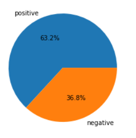
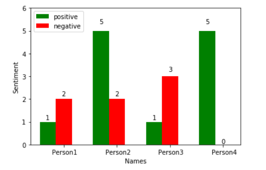

# chat-sentiment

---

Sometimes you may be unclear about what a person is trying to say and you don't want to ask the person to clear what he said. Or you want to analyze someone's chat and you don't want to go through all the chat, you just need a quick answer, that whether they are talking positive or negative. 

In such cases `chat-sentiment` can help you. You just need  a chat and a proper model, using this notebook we can analyze the chat sentiment and display graphs based on sentiment.

---

## Usage

> you need to have `jupyter notebook` configured on your local machine

- Clone the repository

  ```bash
  git clone https://github.com/Reepulse/chat-sentiment.git
  ```

- Change directory into the repository folder

  ```bash
  cd chat-sentiment
  ```

- Start `jupyter notebook` server

  ```bash
  jupyter notebook
  ```

- Click on `analysis.ipynb`

- Open a new terminal window and using `pip` install all the dependencies imported in the notebook 

---

**Note:** Although I have provided a sample chat to test upon, but you can use your own, most messaging applications have option to export chat. You just have  to export chat from messaging application and save chat as chat.txt in the project root.

---

## Overview of the notebook

- This movies uses the `movie_reviews` dataset to train the model
- using the `ntlk` library we download the dataset and then train the model
- And using the model and chat data we generate some visualizations



> Pie chart displaying the ratio between positive and negative message 



> Bar graph displaying positive and negative messages by each person

---

